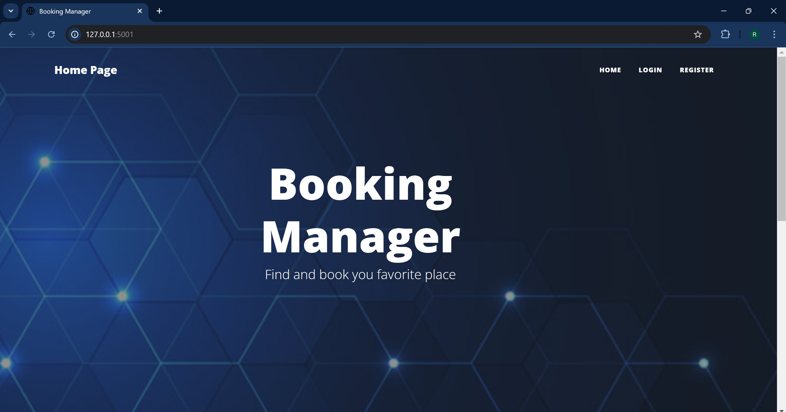
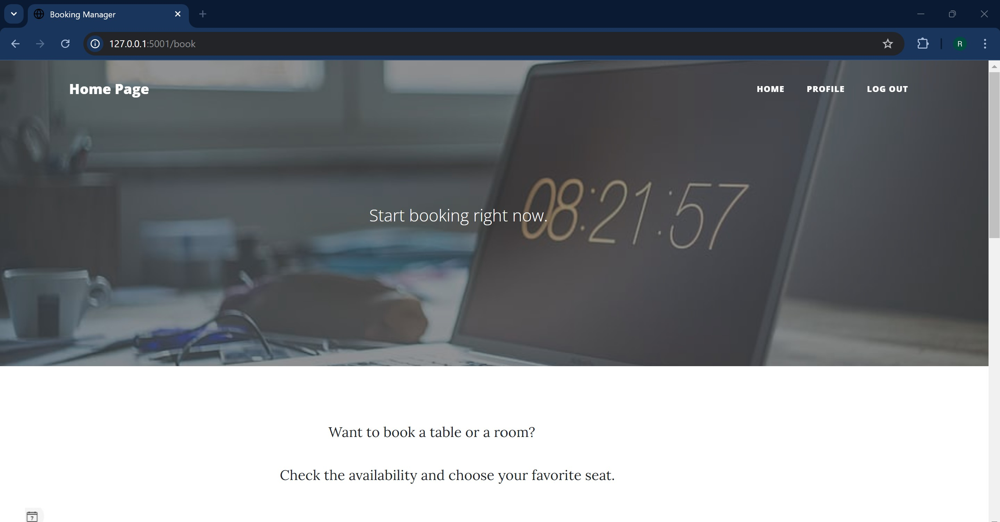
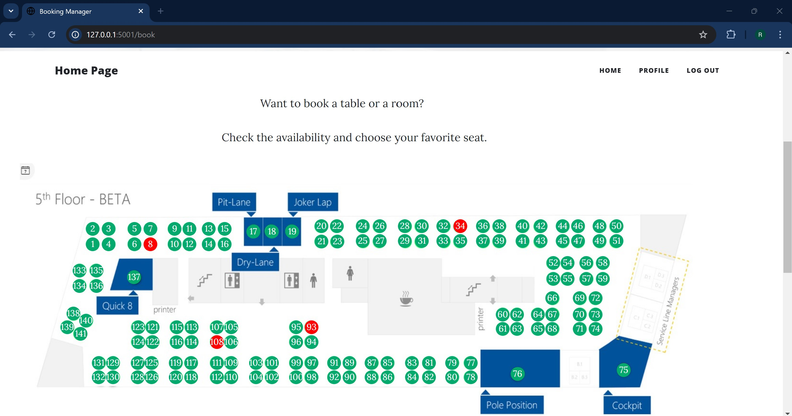
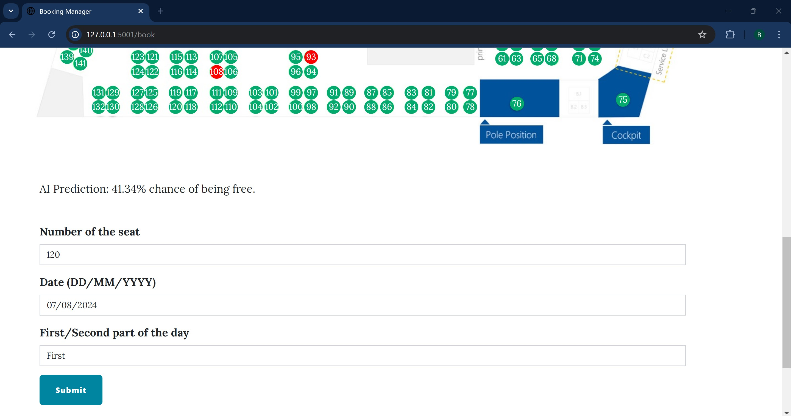
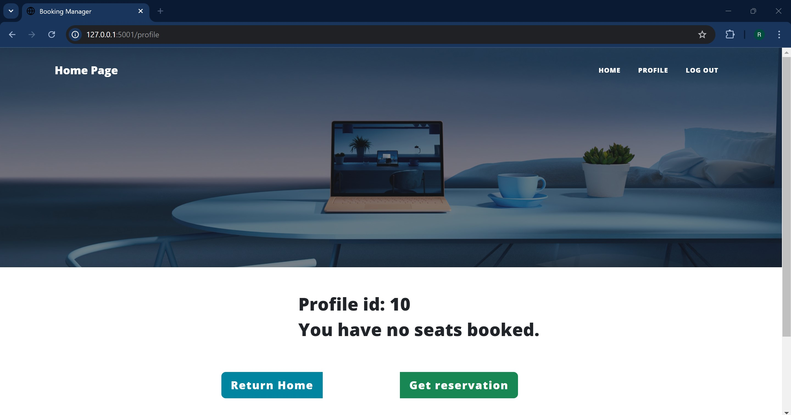
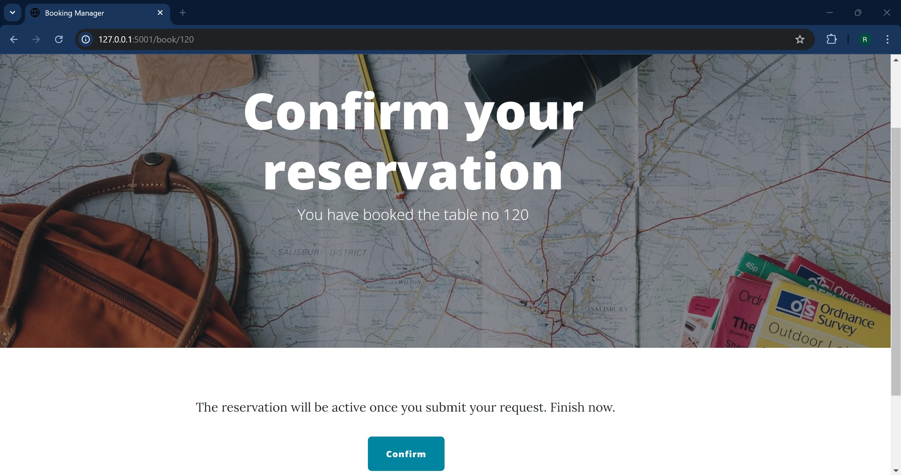
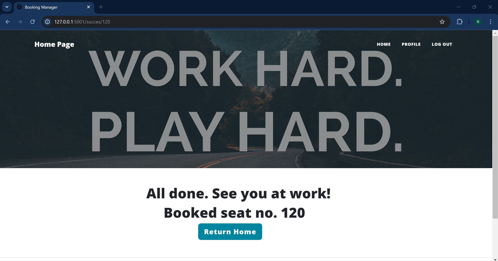
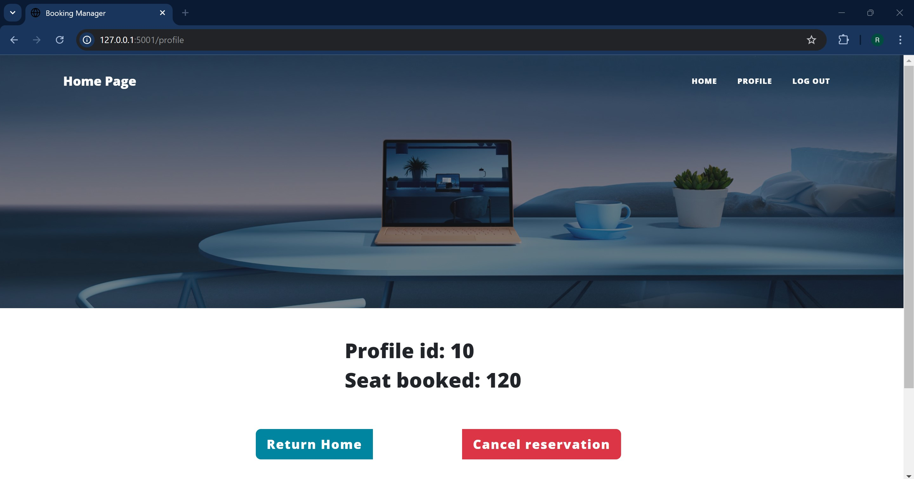

## MHP Hackathon Project
## Descriere
Acest proiect a fost dezvoltat în cadrul hackathonului organizat de MHP. Scopul proiectului a fost de a crea o aplicatie web pentru angajatii companiei, prin care sa isi poata rezerva un loc la masa atunci cand vin la munca. De asemenea, am primit un fisier Excel care continea aproximativ 10.000 de inregistrari despre fiecare loc in parte (zilele si partile din zi cand au fost ocupate) si ni s-a cerut implementarea unui algoritm AI care sa determina probabilitatea ca un anumit loc sa fie liber intr-o zi aleasa de utilizator.

## Limbaje / Librarii / Framework-uri utilizate
- Python
- Flask
- Pandas
- NumPy
- Sklearn
- SQLite

## Capturi de ecran
### Homepage

### Book

### Profile / Select and Confirm Booking

