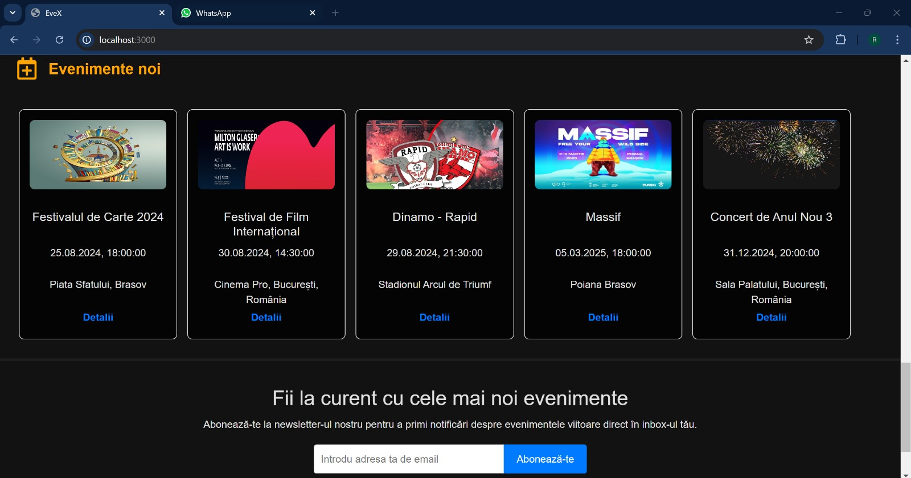

# EveX
## Descriere
EveX este o aplicație pentru gestionarea evenimentelor care permite utilizatorilor să descopere, să participe și să creeze evenimente. Oferă o experiență interactivă pentru vizualizarea biletelor și organizarea de evenimente.
Aplicația include funcționalități de căutare și filtrare a evenimentelor pentru o experiență de utilizare mai bună.

# Limbaje / Framework-uri utilizate
- Frontend: React
- Backend: Spring Boot Microservices, REST APIs
- PostgreSQL

Pentru dezvoltarea backend-ului aplicației EveX, am utilizat arhitectura bazată pe microservicii, implementând mai multe tehnologii și soluții avansate:
- Spring Cloud (Eureka): Utilizat pentru descoperirea serviciilor și gestionarea instanțelor microserviciilor în cadrul arhitecturii de microservicii.
- API Gateway: Configurat pentru a centraliza și a gestiona rutele către microservicii, asigurând un punct de acces unic și uniform pentru client.
- Microservicii: Aplicația este împărțită în trei microservicii principale
    - User-Service: Gestionarea utilizatorilor, autentificarea și autorizația.
    - Event-Service: Gestionarea evenimentelor, inclusiv crearea, actualizarea și     vizualizarea acestora.
    - Order-Service: Procesarea și gestionarea comenzilor de bilete.
- Spring Security: Implementat pentru a asigura securizarea endpoint-urilor din fiecare microserviciu prin autentificare și autorizare.
- JSON Web Tokens (JWT): Utilizate pentru a autentifica și a autoriza utilizatorii, asigurând un mod sigur și eficient de gestionare a sesiunilor de utilizator.

## Capturi de ecran
### Home Page

### Organizer Page

### Event Info

### Buy Tickets

### Profile Wallet

